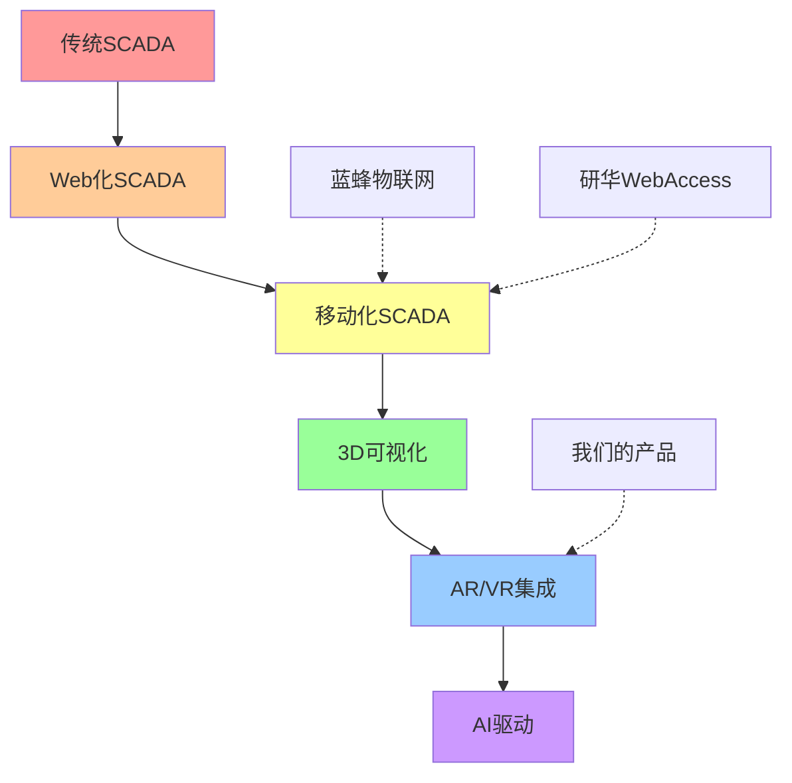

# 竞品对比分析：蓝蜂物联网 vs 研华WebAccess

## 1. 竞品概况对比

| 对比维度 | 蓝蜂物联网 | 研华WebAccess | 我们的方案 |
|---------|-----------|---------------|-----------|
| **公司背景** | 中国创新企业 | 台湾工业巨头(40年) | 新兴技术团队 |
| **目标市场** | 中小企业 | 大中型工业企业 | 中高端市场 |
| **核心优势** | 白标定制、快速部署 | 技术成熟、协议全面 | 现代化技术、3D可视化 |
| **商业模式** | SaaS + 定制服务 | 软件授权 + 硬件 | SaaS + 技术服务 |

## 2. 技术架构对比

### 2.1 整体技术路线

#### 蓝蜂物联网 (EMCP平台)
```
传统Web架构
├── 前端: 传统Web技术栈
├── 后端: EMCP云平台
├── 数据库: 关系型数据库
├── 通信: HTTP/MQTT基础协议
└── 部署: 私有云/公有云
```

#### 研华WebAccess
```
成熟SCADA架构  
├── 前端: HTML5 + Dashboard 2.0
├── 后端: WebAccess Server
├── 数据库: 工业级时序数据库
├── 通信: 全协议支持(Modbus/OPC UA/BACnet)
└── 部署: 本地部署为主
```

#### 我们的方案
```
现代化云原生架构
├── 前端: React + TypeScript + Three.js
├── 后端: Node.js微服务 + GraphQL
├── 数据库: PostgreSQL + InfluxDB + Redis
├── 通信: WebSocket + MQTT + 工业协议
├── 3D引擎: Three.js + WebGL
└── 部署: Kubernetes容器化
```

### 2.2 前端技术对比

| 技术特性 | 蓝蜂物联网 | 研华WebAccess | 我们的方案 |
|---------|-----------|---------------|-----------|
| **UI框架** | 传统Web | HTML5 + Dashboard 2.0 | React + TypeScript |
| **图表库** | 基础图表 | ECharts集成 | ECharts + D3.js |
| **3D支持** | ❌ 无 | ❌ 无 | ✅ Three.js原生支持 |
| **移动端** | 响应式Web + 原生App | WebAccess APP | PWA + 原生App |
| **实时更新** | WebSocket | WebSocket + SignalR | WebSocket + GraphQL订阅 |
| **自定义组件** | 基础模板 | Widget Builder | React组件 + 3D组件 |

### 2.3 数据可视化对比

#### 蓝蜂物联网
- **2D仪表盘**: ✅ 圆形仪表、数字显示
- **工艺流程图**: ✅ 基础P&ID图
- **动态效果**: ✅ 设备状态颜色变化
- **3D可视化**: ❌ 不支持
- **AR/VR**: ❌ 不支持

#### 研华WebAccess  
- **2D仪表盘**: ✅ 专业SCADA界面
- **工艺流程图**: ✅ 完整P&ID支持
- **动态效果**: ✅ 丰富的工业动画
- **Widget Builder**: ✅ 自定义组件构建
- **3D可视化**: ❌ 不支持
- **移动优化**: ✅ 专用移动App

#### 我们的方案
- **2D仪表盘**: ✅ 现代化仪表设计
- **工艺流程图**: ✅ SVG动态P&ID
- **3D工厂模型**: ✅ 完整3D场景
- **数据驱动动画**: ✅ 3D设备实时动画
- **工业特效**: ✅ 流体、热力图、粒子效果
- **Widget Builder**: ✅ React组件化
- **AR扩展**: 🔄 规划中

## 3. 功能特性对比

### 3.1 核心功能矩阵

| 功能模块 | 蓝蜂物联网 | 研华WebAccess | 我们的方案 |
|---------|-----------|---------------|-----------|
| **设备管理** | ✅ 基础管理 | ✅ 专业级管理 | ✅ 智能化管理 |
| **实时监控** | ✅ 2D监控 | ✅ 专业SCADA | ✅ 2D+3D监控 |
| **历史数据** | ✅ 基础查询 | ✅ 专业报表 | ✅ AI分析 |
| **告警系统** | ✅ 基础告警 | ✅ 完整告警 | ✅ 3D场景告警 |
| **用户权限** | ✅ 基础RBAC | ✅ 企业级权限 | ✅ 现代化权限 |
| **移动支持** | ✅ App+Web | ✅ 专用App | ✅ PWA+App |
| **API接口** | ✅ REST API | ✅ REST+OPC | ✅ GraphQL+REST |
| **白标定制** | ✅ 核心优势 | ❌ 不支持 | ✅ 多租户支持 |

### 3.2 协议支持对比

#### 蓝蜂物联网
```javascript
const protocols = {
  basic: ['HTTP', 'MQTT', 'WebSocket'],
  industrial: ['Modbus基础支持'],
  strength: '易于集成，适合物联网设备',
  weakness: '工业协议支持有限'
}
```

#### 研华WebAccess
```javascript
const protocols = {
  basic: ['HTTP', 'MQTT', 'WebSocket'],
  industrial: [
    'Modbus RTU/TCP', 'OPC UA/DA', 'Ethernet/IP',
    'DNP3', 'BACnet', 'SNMP'
  ],
  strength: '工业协议支持最全面',
  weakness: '配置复杂，学习成本高'
}
```

#### 我们的方案
```javascript
const protocols = {
  basic: ['HTTP', 'MQTT', 'WebSocket', 'GraphQL'],
  industrial: [
    'Modbus RTU/TCP', 'OPC UA', 'BACnet基础',
    '可扩展协议架构'
  ],
  strength: '现代化接口 + 核心工业协议',
  weakness: '需要逐步完善协议支持'
}
```

## 4. 商业模式分析

### 4.1 目标客户群体

#### 蓝蜂物联网
- **主要客户**: 中小型制造企业、系统集成商
- **行业聚焦**: 通用制造业、环保、农业
- **客户痛点**: 成本敏感、快速上线、品牌化需求
- **价值主张**: 低成本、快速部署、白标定制

#### 研华WebAccess
- **主要客户**: 大中型工业企业、OEM厂商
- **行业聚焦**: 重工业、电力、石化、制药
- **客户痛点**: 技术可靠性、标准合规、长期支持
- **价值主张**: 技术成熟、标准兼容、全球支持

#### 我们的定位
- **目标客户**: 技术前瞻的中高端企业
- **行业聚焦**: 智能制造、新能源、高端装备
- **客户痛点**: 技术创新、用户体验、数字化转型
- **价值主张**: 现代化技术、3D可视化、AI驱动

### 4.2 定价策略对比

| 定价维度 | 蓝蜂物联网 | 研华WebAccess | 我们的策略 |
|---------|-----------|---------------|-----------|
| **计费模式** | 按设备数/用户数 | 软件许可 + 硬件 | SaaS订阅 + 增值服务 |
| **起始价格** | 较低 | 较高 | 中等 |
| **白标费用** | 核心产品 | 不提供 | 高端服务 |
| **定制开发** | 标准报价 | 项目制 | 敏捷开发 |

## 5. 竞争优劣势分析

### 5.1 蓝蜂物联网 SWOT

#### 优势 (Strengths)
- ✅ **白标定制**: 企业品牌化解决方案
- ✅ **快速部署**: 标准化产品快速上线
- ✅ **成本优势**: 适合中小企业预算
- ✅ **多端支持**: Web+App+微信完整覆盖
- ✅ **本土化**: 深度理解中国市场需求

#### 劣势 (Weaknesses)
- ❌ **技术深度**: 工业协议支持有限
- ❌ **可视化**: 缺乏3D和高级可视化
- ❌ **AI能力**: 智能分析功能不足
- ❌ **品牌影响**: 相比国际品牌认知度较低

### 5.2 研华WebAccess SWOT

#### 优势 (Strengths)
- ✅ **技术成熟**: 40年工业自动化经验
- ✅ **协议全面**: 支持几乎所有工业标准
- ✅ **生态完整**: 硬件+软件一体化方案
- ✅ **全球化**: 国际化产品和服务
- ✅ **品牌权威**: 工业计算领域领导者

#### 劣势 (Weaknesses)
- ❌ **界面传统**: UI/UX相对陈旧
- ❌ **学习成本**: 配置复杂，专业性要求高
- ❌ **创新速度**: 大企业创新相对缓慢
- ❌ **定制化**: 白标定制支持不足

### 5.3 我们的竞争策略

#### 差异化优势
```typescript
const ourAdvantages = {
  technology: {
    '3D可视化': '行业首创的Web 3D工业监控',
    '现代技术栈': 'React + TypeScript + 云原生',
    'AI集成': '智能异常检测和预测分析',
    '用户体验': '现代化设计，降低学习成本'
  },
  
  business: {
    '敏捷开发': '快速迭代，响应市场变化',
    '技术服务': '深度技术支持和定制开发',
    '成本效益': '现代架构带来的成本优势',
    '多租户': '一套系统服务多个客户'
  },
  
  market: {
    '细分市场': '专注技术前瞻的中高端客户',
    '垂直深耕': '选择重点行业深度优化',
    '合作生态': '与硬件厂商和集成商合作',
    '开源策略': '部分组件开源建立生态'
  }
}
```

## 6. 技术发展趋势分析

### 6.1 工业可视化发展趋势

#### 当前主流 (蓝蜂、研华代表)
- 2D仪表盘为主
- 基础工艺流程图
- 传统Web技术
- 响应式设计

#### 技术发展方向 (我们的机会)
- **3D数字孪生**: 工厂和设备的3D虚拟化
- **沉浸式体验**: AR/VR在工业中的应用
- **AI可视化**: 智能数据分析的可视化展示
- **云原生**: 微服务和容器化架构
- **边缘计算**: 本地处理 + 云端分析

### 6.2 市场机会窗口



## 7. 竞争策略建议

### 7.1 短期策略 (6-12个月)

#### 技术突破
- **3D可视化优势**: 率先推出工业级3D监控界面
- **用户体验**: 打造比竞品更易用的产品
- **核心协议**: 重点支持Modbus和OPC UA
- **移动优化**: 提供优秀的移动端体验

#### 市场定位
- **避开红海**: 不与研华在传统SCADA市场直接竞争
- **细分切入**: 专注新兴行业和技术前瞻客户
- **技术先导**: 以技术创新建立差异化优势
- **合作共赢**: 与硬件厂商建立合作关系

### 7.2 中期策略 (1-2年)

#### 产品完善
- **协议扩展**: 逐步完善工业协议支持
- **AI集成**: 深度集成机器学习和预测分析
- **生态建设**: 建立合作伙伴和开发者生态
- **行业深化**: 在选定行业建立标杆案例

#### 商业拓展
- **白标服务**: 提供比蓝蜂更高端的白标定制
- **垂直解决方案**: 针对特定行业的完整解决方案
- **国际化**: 逐步向海外市场扩展
- **开源策略**: 部分组件开源建立技术影响力

### 7.3 长期策略 (3-5年)

#### 技术领导
- **标准制定**: 参与或主导新的工业可视化标准
- **平台化**: 建立完整的工业IoT平台生态
- **AI平台**: 成为工业AI可视化的领导者
- **边缘云**: 边缘计算 + 云端分析的完整方案

#### 市场地位
- **细分领先**: 在3D工业可视化领域建立领导地位
- **生态中心**: 成为工业可视化生态的核心
- **技术品牌**: 建立强有力的技术品牌认知
- **全球化**: 在全球市场建立影响力

## 8. 风险评估与应对

### 8.1 主要风险

#### 技术风险
- **3D性能**: Web端3D渲染的性能挑战
- **协议复杂**: 工业协议的实现复杂度
- **兼容性**: 不同浏览器和设备的兼容性

#### 市场风险
- **客户接受度**: 传统工业客户对新技术的接受速度
- **竞品跟进**: 蓝蜂和研华可能快速跟进3D功能
- **标准演进**: 工业标准的变化可能影响产品方向

### 8.2 应对策略

#### 技术应对
- **性能优化**: 建立完善的3D性能优化体系
- **渐进增强**: 提供2D+3D的渐进式体验
- **标准跟踪**: 持续跟踪工业标准的发展

#### 市场应对
- **教育市场**: 通过技术演示和案例教育市场
- **快速迭代**: 保持技术创新的领先优势
- **生态建设**: 通过生态合作降低竞品威胁

## 9. 总结与建议

### 9.1 竞争格局总结

| 竞争维度 | 蓝蜂物联网 | 研华WebAccess | 我们的机会 |
|---------|-----------|---------------|-----------|
| **技术成熟度** | 中等 | 很高 | 🎯 现代化技术栈 |
| **可视化能力** | 基础 | 专业2D | 🎯 3D+AI可视化 |
| **用户体验** | 中等 | 传统 | 🎯 现代化UX |
| **定制化** | 白标优势 | 限制较多 | 🎯 多租户架构 |
| **目标市场** | 中小企业 | 大企业 | 🎯 中高端细分 |

### 9.2 核心建议

1. **技术优先**: 以3D可视化和现代化技术建立差异化优势
2. **用户体验**: 专注于提供比竞品更好的用户体验
3. **细分定位**: 避开红海竞争，专注中高端细分市场
4. **快速迭代**: 保持敏捷开发，快速响应市场需求
5. **生态合作**: 与硬件厂商和系统集成商建立合作关系

### 9.3 成功关键因素

- **技术创新**: 持续的3D可视化和AI技术投入
- **产品体验**: 现代化的用户界面和交互设计
- **市场教育**: 让客户理解3D可视化的价值
- **团队建设**: 建立具备工业+3D+AI复合能力的团队
- **客户成功**: 通过标杆客户建立市场信誉

通过差异化的技术路线和精准的市场定位，我们有机会在竞争激烈的工业监控市场中建立自己的优势地位。